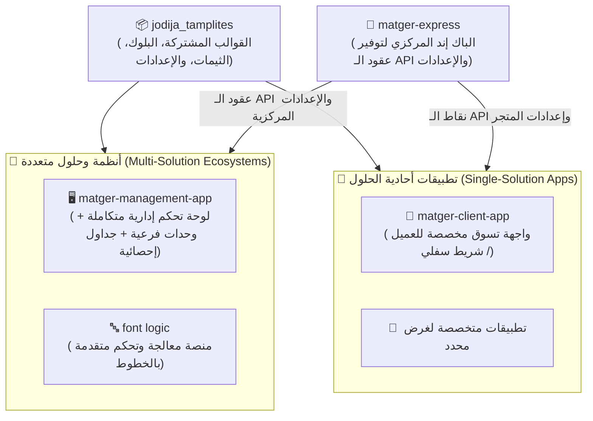

<div align="center">

# 🚀 قوالب جوديجا (JoDija Templates) - النواة الشاملة للأنظمة والتطبيقات

**حزمة فلاتر متطورة لتأسيس لوحات التحكم، التطبيقات الأحادية، والمنصات متعددة الوحدات مع دعم كامل ومحلي للغة العربية ونظام RTL.**

[](https://flutter.dev)
[](https://dart.dev)
[](LICENSE)
[](#-دعم-اللغة-العربية-واتجاه-rtl-المدمج)

[English Documentation (README.md)](README.md) • [📚 بوابة التوثيق الكاملة (doc/README.md)](doc/README.md)

</div>

---

## 📸 معرض الواجهات والقوالب الحية (Real UI Showcase)

نماذج حية تم بناؤها باستخدام `JoDija Templates` مثل نظام **Delta Mager Pro**:

<div align="center">
  
  <p><strong>لوحة تحكم المنتجات (Products Dashboard)</strong>: القائمة الجانبية (Sidebar) بنظام RTL مع كبسولات التصفية وشبكة البطاقات المتجاوبة وبادجات (الأكثر مبيعاً وخصم كبير).</p>
</div>

<div align="center">
  
  <p><strong>لوحة إدارة الفئات والكتالوج (Categories Dashboard)</strong>: إبراز العنصر النشط في القائمة الجانبية، شريط البحث، وزر الإضافة بالثيم الزيتي المخصص.</p>
</div>

---

## 🏛️ الفلسفة المعمارية: التطبيقات أحادية الحلول vs متعددة الحلول

تعتمد الحزمة على ركيزة معمارية أساسية تدعم نمطين من التطبيقات مع إعادة استخدام الكود بنسبة 100%:



### 1. التطبيقات أحادية الحلول (Single-Solution Apps)
- **الهدف:** حل مشكلة واحدة ومحددة للمستخدم النهائي بأعلى كفاءة وسرعة.
- **أمثلة:** تطبيق العميل (`matger-client-app`) الذي يركز على تصفح المنتجات، سلة المشتريات، وإتمام الطلب.
- **الخصائص:** مسارات خفيفة، شريط تنقل سفلي (`BottomNavigationBar`)، واستخدام مباشر لطبقة إدارة الحالات والبيانات.

### 2. التطبيقات والأنظمة متعددة الحلول (Multi-Solution Apps)
- **الهدف:** إدارة عمليات تشغيلية معقدة وربط عدة موديولات وأنظمة في واجهة واحدة.
- **أمثلة:** نظام `font logic` لإدارة ومعالجة الخطوط، ولوحة تحكم المتجر (`matger-management-app`) لإدارة المنتجات، الفئات، الطلبات، والتقارير المالية.
- **الخصائص:** تعتمد على `AdaptiveAppShell` لتغيير التخطيط آلياً بين شاشات الكمبيوتر والتابلت والجوال، مع نظام `Cell Models` للجداول والتقارير الإحصائية.

### 3. خادم الباك إند الموحد (`matger-express`)
- يمثل المزود المركزي لعقود البيانات (API Contracts)، وإعدادات التطبيقات الحية (Dynamic Configurations)، ومفاتيح الميزات (Feature Flags) لكلا النمطين.

---

## 🌟 كافة مميزات الحزمة بالتفصيل

### 1. 🧭 القالب المتجاوب الذكي (`AdaptiveAppShell`)
- **تخطيط ديناميكي متكيف:** تحويل تلقائي بين القائمة الجانبية الثابتة (`Sidebar`) على الشاشات الكبيرة، والقائمة المنزلقة (`Drawer`) أو الشريط السفلي (`BottomNavBar`) على شاشات الجوال.
- **توجيه مدمج قوي (`GoRouter`):** دعم الروابط العميقة (Deep Linking)، المعاملات المتغيرة (`:id`)، ومتغيرات الاستعلام (`?query=value`).
- **شريط تطبيق مرن (`AppBarConfig`):** تحكم كامل في الأزرار الإضافية، العناوين، وإجراءات الرجوع والقائمة.

### 2. 🌍 دعم اللغة العربية واتجاه RTL المدمج
- **ملاءمة تلقائية للـ RTL:** انعكاس تلقائي لكافة عناصر القوائم، الحركات، والمسارات بمجرد تحديد `languageCode: 'ar'`.
- **محرك اللغات والترجمة (`LocalizationConfig` & `AppLocalizationsInit`):** إدارة الكلمات المترجمة والتبديل الفوري بين العربية والإنجليزية.
- **دعم خطوط Google العربية:** تهيئة جاهزة لأشهر الخطوط العربية مثل Cairo و Tajawal و Almarai.

### 3. 🧩 إدارة الحالات وطبقة البيانات الموحدة (`DataSourceBloc`)
- **حالات موحدة للبيانات (`FeaturDataSourceState`):** كلاس جاهز يدير حالات التحميل، النجاح، الخطأ، والقوائم الفارغة.
- **عمليات الـ CRUD الجاهزة (`BaseBloc` & `CrudBloc`):** تقليل كتابة الكود المكرر لعمليات جلب وحفظ وتعديل البيانات.

### 4. 📊 محرك الجداول والخلايا الذكية (`Cell Models`)
- **معالجة متقدمة للجداول (`DataTableOfCellModels`):** تحويل نماذج البيانات إلى صفوف وخلايا ديناميكية.
- **عمليات إحصائية جاهزة:** استخراج المجموعات الفريدة (`unicGrubs`) وحساب التكرارات والمجاميع (`countBy`).

### 5. 🎨 نظام التصميم والثيمات الديناميكية (`Theming System`)
- **لوحة ألوان قياسية (`AppColors`):** تحكم في ألوان الهوية، النصوص، الأزرار، والفواصل.
- **ثيمات مخصصة (`DashboardThemes`):** دعم الثيم الفاتح والداكن وتخصيص ثيمات لوحات التحكم الإدارية (مثل الثيم الزيتي أو الأزرق).

### 6. 💾 التخزين المحلي وإدارة الجلسات
- **مدير التخزين (`SharedPrefranceData`):** إدارة وحفظ جلسة المستخدم والـ Tokens بأمان وسرعة بنمط Singleton.
- **دعم قواعد بيانات SQLite (`sqllite_helper.dart`):** لحفظ واسترجاع البيانات محلياً والعمل بدون إنترنت (Offline Caching).

### 7. ✅ أدوات التحقق من المدخلات (Form Validation)
- دوال وحقول تحقق جاهزة: `RequiredValidator`, `EmailValidator`, `PasswordValidator`, `NumberValidator`.

---

## ⚡ خطوات البدء السريع (Quick Start)

### 1. إعداد كلاس الـ Configuration
```dart
import 'package:flutter/material.dart';
import 'package:JoDija_tamplites/project_configrations/app_configration.dart';

class MatgerConfig extends DataViewConfigraion {
  @override
  String get AppName => "Delta Mager Pro";

  @override
  Widget launchScreen() => const ProductsScreen();

  @override
  Map<String, Widget> getRouters() => {
    '/dashboard': const DashboardScreen(),
    '/products': const ProductsScreen(),
    '/categories': const CategoriesScreen(),
  };

  @override
  void setAppLocal(String localCode) {
    // ضبط اللغة واتجاه الواجهة
  }
}
```

### 2. تهيئة وتشغيل الـ `AdaptiveAppShell`
```dart
import 'package:flutter/material.dart';
import 'package:JoDija_tamplites/tampletes/screens/routed_contral_panal/laaunser.dart';
import 'package:JoDija_tamplites/tampletes/screens/routed_contral_panal/models/route_item.dart';

void main() {
  runApp(const MyApp());
}

class MyApp extends StatelessWidget {
  const MyApp({super.key});

  @override
  Widget build(BuildContext context) {
    return AdaptiveAppShell(
      titleApp: "Delta Mager Pro",
      initRouter: "/products",
      languageCode: "ar", // تفعيل اللغة العربية ونظام RTL تلقائياً
      isDarkMode: false,
      
      // تخصيص ألوان القائمة الجانبية (الثيم الزيتي المميز)
      sidebarBackgroundColor: const Color(0xFF556B2F),
      sidebarSelectedColor: Colors.white,
      sidebarTextColor: Colors.white,
      sidebarSelectedTextColor: const Color(0xFF556B2F),
      
      sidebarItems: [
        RouteItem(
          id: "dashboard",
          path: "/dashboard",
          label: "لوحة التحكم",
          icon: Icons.dashboard_outlined,
          content: const DashboardScreen(),
          isSideBarRouted: true,
          isAppBar: true,
        ),
        RouteItem(
          id: "products",
          path: "/products",
          label: "المنتجات",
          icon: Icons.inventory_2_outlined,
          content: const ProductsScreen(),
          isSideBarRouted: true,
          isAppBar: true,
        ),
        RouteItem(
          id: "categories",
          path: "/categories",
          label: "الفئات",
          icon: Icons.category_outlined,
          content: const CategoriesScreen(),
          isSideBarRouted: true,
          isAppBar: true,
        ),
      ],
    );
  }
}
```

---

## 📚 فهرس الأدلة التوثيقية الشاملة

| الدليل | الموضوع الرئيسي | الرابط |
| :--- | :--- | :--- |
| **الفلسفة والمعمارية** | معمارية الحلول الأحادية والمتعددة ودور matger-express | [PHILOSOPHY_AND_ARCHITECTURE.md](doc/01_architecture/PHILOSOPHY_AND_ARCHITECTURE.md) |
| **دليل الـ Configuration** | شرح DataViewConfigraion وموصل الشبكة AppHttpConnector | [CONFIGURATION_GUIDE.md](doc/01_architecture/CONFIGURATION_GUIDE.md) |
| **دليل Adaptive App Shell** | الدليل الكامل لتخصيص القوالب والـ Sidebar والأنيميشن | [ADAPTIVE_APP_SHELL_GUIDE.md](doc/02_templates/ADAPTIVE_APP_SHELL_GUIDE.md) |
| **دليل الأدوات المشتركة** | توثيق الـ Bloc، الجداول، التخزين، والتحقق | [SHARED_UTILS_GUIDE.md](doc/03_utils/SHARED_UTILS_GUIDE.md) |
| **دليل تكامل منظومة المتجر** | ربط Matger Management + Client مع Express | [MATGER_ECOSYSTEM_INTEGRATION.md](doc/04_integrations/MATGER_ECOSYSTEM_INTEGRATION.md) |

---

## 📄 الترخيص (License)
هذا المشروع مرخص بموجب رخصة MIT - راجع ملف [LICENSE](LICENSE) لمزيد من التفاصيل.
