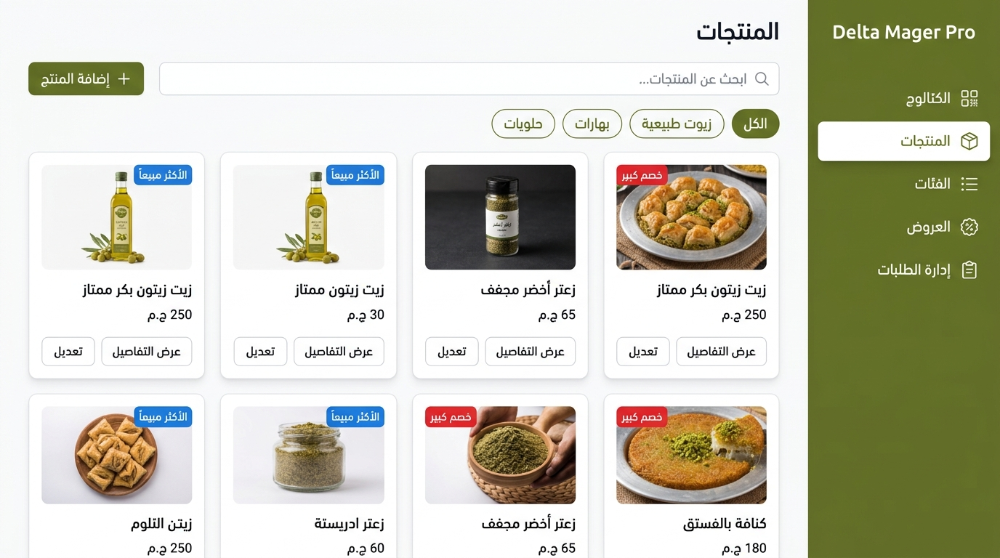
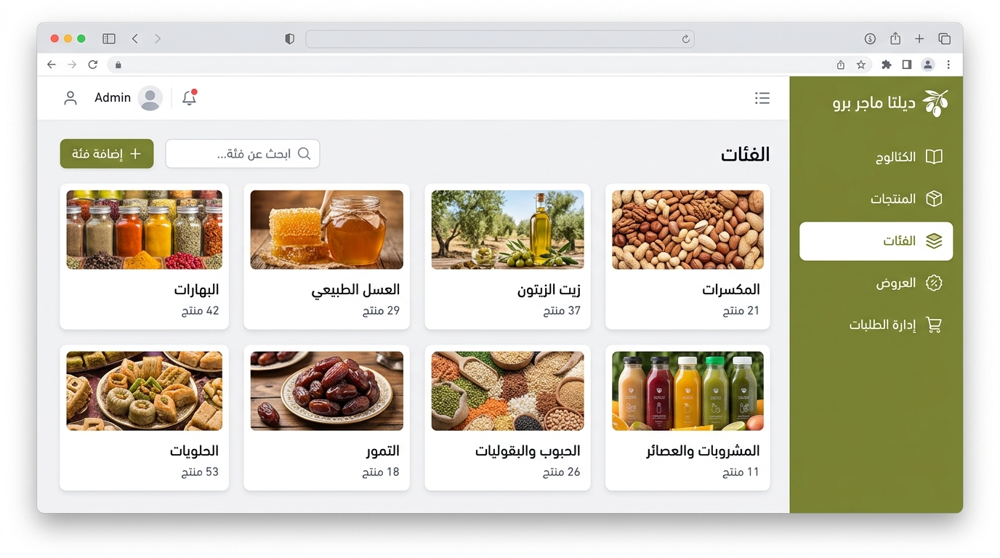
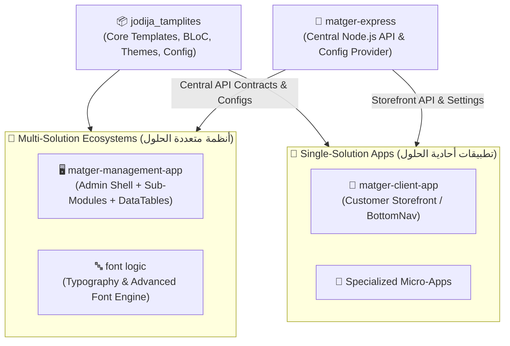

<div align="center">

# 🚀 JoDija Templates (Adaptive App Shell & Enterprise Toolkit)

**حزمة فلاتر المتقدمة لبناء لوحات التحكم، التطبيقات الأحادية، والأنظمة المتعددة مع دعم RTL كامل والتوجيه المتجاوب.**

[](https://flutter.dev)
[](https://dart.dev)
[](LICENSE)
[](#-native-rtl--localization-support)
[](#-documentation-index)

[📖 قراءة التوثيق باللغة العربية (README.ar.md)](README.ar.md) • [📚 بوابة التوثيق الكاملة (doc/README.md)](doc/README.md)

</div>

---

## 📸 Real UI Showcase (معاينات الواجهات والقوالب الحية)

مستوحاة من التطبيقات الحقيقية المبنية على الحزمة مثل **Delta Mager Pro**:

<div align="center">
  
  <p><em>لوحة تحكم المنتجات (Products Dashboard) مع القائمة الجانبية بالثيم المخصص وشبكة البطاقات المتجاوبة بنظام RTL</em></p>
</div>

<div align="center">
  
  <p><em>لوحة إدارة الفئات والكتالوج (Categories Dashboard) مع الـ Filter Chips والـ Header المخصص</em></p>
</div>

---

## 🏛️ الفلسفة المعمارية (Single-Solution vs Multi-Solution Architecture)

بنيت حزمة `JoDija Templates` على فلسفة موحدة تدعم نمطين أساسيين من التطبيقات دون تكرار الكود:



1. **تطبيقات أحادية الحلول (Single-Solution Apps):**
   - تطبيقات تركز على تدفق واستخدام محدد (مثل `matger-client-app` كمتجر عميل مع شريط تنقل سفلي).
   - سرعة فائقة وعزل للمهام واستفادة مباشرة من الـ Core Utilities وطبقة الـ Bloc.
2. **تطبيقات متعددة الحلول (Multi-Solution Apps / Modular Ecosystems):**
   - منصات متكاملة تحتوي على وحدات متعددة وشاشات إدارية متداخلة (مثل `font logic` لإدارة ومعالجة الخطوط، و `matger-management-app` لإدارة المخزون والمبيعات والكتالوج).
   - تستفيد من `AdaptiveAppShell` لتغيير التخطيط آلياً بين Desktop/Tablet/Mobile، ونظام `Cell Models` للجداول والتقارير.
3. **العمود الفقري المشترك (`matger-express`):**
   - يوفر عقود البيانات الموحدة (Data Contracts) وإعدادات النظام الحية والـ Feature Flags لكلا النمطين.

---

## 🌟 Comprehensive Features (كافة مميزات المكتبة)

### 1. 🧭 Responsive Adaptive App Shell
- **تبديل تلقائي للتخطيط:** تحويل ذكي بين القائمة الجانبية الثابتة (`Sidebar`) على الديسك توب والويب، والقائمة المنزلقة (`Drawer`) أو شريط التنقل السفلي (`BottomNavigationBar`) على الجوال.
- **توجيه متقدم (`GoRouter` مدمج):** دعم مسارات URL المباشرة، الـ Deep Linking، معاملات المسار (`:id`) واستعلامات البحث (`?query=val`).
- **شريط علوي مخصص (`AppBarConfig`):** تحكم كامل في الأزرار والإجراءات والعناوين وحالة الرجوع.

### 2. 🌍 Native RTL & Arabic Localization
- **دعم كامل للغة العربية والاتجاه RTL:** انعكاس القوائم الجانبية، الرسوم المتحركة، الأيقونات، ونصوص الواجهة بسلاسة ودون كسر للتصميم.
- **محرك ترجمة مدمج (`LocalizationConfig` & `AppLocalizationsInit`):** إدارة متعددة اللغات مع التبديل اللحظي للغة دون إعادة تشغيل التطبيق.
- **دعم خطوط Google:** تهيئة خطوط عربية جميلة مثل Cairo, Tajawal, Almarai.

### 3. 🧩 State Management & Unified Data Layer (`DataSourceBloc`)
- **نمط حالات موحد:** كلاس `FeaturDataSourceState` لإدارة الحالات المشتركة (Initial, Loading, Loaded, Error, Empty).
- **عمليات الـ CRUD الجاهزة:** كلاسات `BaseBloc` و `CrudBloc` لتسريع بناء الشاشات التي تعتمد على جلب وتعديل وحذف البيانات.

### 4. 📊 Advanced Cell & Data Table Engine (`Cell Models`)
- **تحويل وهيكلة البيانات:** تحويل أي نموذج `BaseViewDataModel` إلى خلايا ذكية `RowofCells` و `Cell`.
- **معالجة وحسابات الجداول (`DataTableOfCellModels`):** استخراج القيم الفريدة (`unicGrubs`)، التجميع الإحصائي (`countBy`)، وتجهيز البيانات للعرض في الجداول والتقارير.

### 5. 🎨 Design System & Dynamic Theming
- **نظام ألوان متكامل (`AppColors`):** إدارة الألوان الأساسية، الفرعية، درجات النصوص، وعناصر التحكم.
- **ثيمات متجاوبة (`AppThemes` & `DashboardThemes`):** دعم الوضع الفاتح والداكن (Light/Dark Mode) وتخصيص ثيمات لوحات التحكم الإدارية.

### 6. 💾 Local Storage & Session Management
- **إدارة الجلسات (`SharedPrefranceData`):** تخزين وإدارة بيانات المستخدم، حالة تسجيل الدخول، وحفظ الـ Auth Tokens والـ Headers بأمان.
- **دعم SQLite مدمج (`sqllite_helper.dart`):** لحفظ البيانات محلياً للعمل بدون اتصال (Offline-first caching).

### 7. ✅ Form Validation & Input Helpers
- حقول إدخال ومحققات جاهزة: `RequiredValidator`, `EmailValidator`, `PasswordValidator`, `NumberValidator` مع رسائل خطأ معربة.

---

## ⚡ Quick Start (البدء السريع)

### 1. إعداد الـ Configuration العام

قم بإنشاء كلاس إعدادات يرث من `DataViewConfigraion`:

```dart
import 'package:flutter/material.dart';
import 'package:JoDija_tamplites/project_configrations/app_configration.dart';

class MyAppConfig extends DataViewConfigraion {
  @override
  String get AppName => "Delta Mager Pro";

  @override
  Widget launchScreen() => DashboardScreen();

  @override
  Map<String, Widget> getRouters() => {
    '/dashboard': DashboardScreen(),
    '/products': ProductsScreen(),
    '/categories': CategoriesScreen(),
  };

  @override
  void setAppLocal(String localCode) {
    // تحديث لغة التطبيق
  }
}
```

### 2. تشغيل الـ `AdaptiveAppShell`

```dart
import 'package:flutter/material.dart';
import 'package:JoDija_tamplites/tampletes/screens/routed_contral_panal/laaunser.dart';
import 'package:JoDija_tamplites/tampletes/screens/routed_contral_panal/models/route_item.dart';

void main() {
  runApp(const MainApp());
}

class MainApp extends StatelessWidget {
  const MainApp({super.key});

  @override
  Widget build(BuildContext context) {
    return AdaptiveAppShell(
      titleApp: "Delta Mager Pro",
      initRouter: "/products",
      languageCode: "ar", // تفعيل اللغة العربية ونظام RTL تلقائياً
      isDarkMode: false,
      
      // ثيم القائمة الجانبية
      sidebarBackgroundColor: const Color(0xFF556B2F), // ثيم زيتي احترافي
      sidebarSelectedColor: Colors.white,
      sidebarTextColor: Colors.white,
      sidebarSelectedTextColor: const Color(0xFF556B2F),
      
      sidebarItems: [
        RouteItem(
          id: "dashboard",
          path: "/dashboard",
          label: "لوحة التحكم",
          icon: Icons.dashboard_outlined,
          content: const DashboardScreen(),
          isSideBarRouted: true,
          isAppBar: true,
        ),
        RouteItem(
          id: "products",
          path: "/products",
          label: "المنتجات",
          icon: Icons.inventory_2_outlined,
          content: const ProductsScreen(),
          isSideBarRouted: true,
          isAppBar: true,
        ),
        RouteItem(
          id: "categories",
          path: "/categories",
          label: "الفئات",
          icon: Icons.category_outlined,
          content: const CategoriesScreen(),
          isSideBarRouted: true,
          isAppBar: true,
        ),
      ],
    );
  }
}
```

---

## 📚 Documentation Index (فهرس التوثيق والأدلة)

| الدليل | الوصف | الرابط |
| :--- | :--- | :--- |
| **README العربي** | الدليل والواجهة التوثيقية الكاملة باللغة العربية | [README.ar.md](README.ar.md) |
| **الفلسفة والمعمارية** | مقارنة معمارية الحلول الأحادية والمتعددة وتكامل الباك إند | [PHILOSOPHY_AND_ARCHITECTURE.md](doc/01_architecture/PHILOSOPHY_AND_ARCHITECTURE.md) |
| **دليل الـ Configuration** | شرح `DataViewConfigraion` و `AppHttpConnector` | [CONFIGURATION_GUIDE.md](doc/01_architecture/CONFIGURATION_GUIDE.md) |
| **دليل Adaptive App Shell** | الدليل الشامل للقوالب، الألوان، الشاشات المتجاوبة، والأنيميشن | [ADAPTIVE_APP_SHELL_GUIDE.md](doc/02_templates/ADAPTIVE_APP_SHELL_GUIDE.md) |
| **دليل الأدوات المشتركة** | توثيق الـ BLoC، الجداول، التخزين المحلي، والـ Validators | [SHARED_UTILS_GUIDE.md](doc/03_utils/SHARED_UTILS_GUIDE.md) |
| **دليل تكامل منظومة المتجر** | ربط `matger-management-app` و `matger-client-app` مع `matger-express` | [MATGER_ECOSYSTEM_INTEGRATION.md](doc/04_integrations/MATGER_ECOSYSTEM_INTEGRATION.md) |

---

## 📄 License
This project is licensed under the MIT License - see the [LICENSE](LICENSE) file for details.
