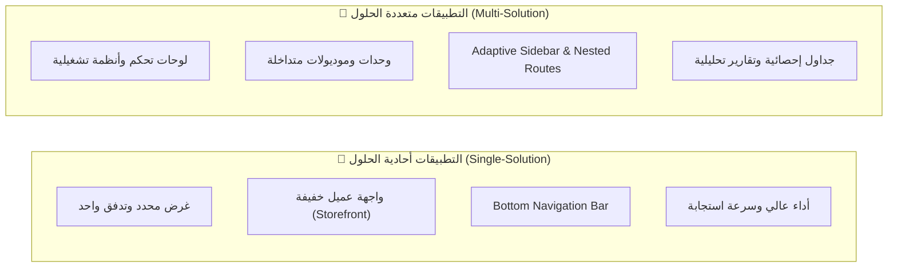
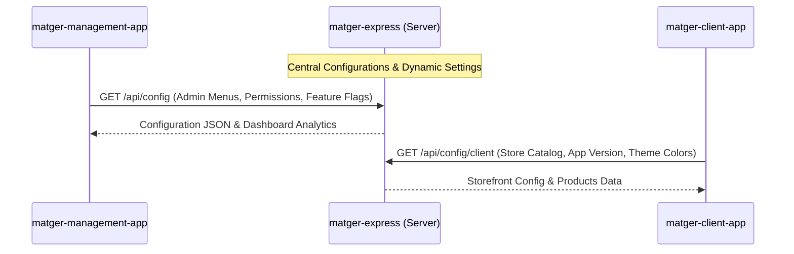

# 🏛️ الفلسفة المعمارية: التطبيقات أحادية الحلول vs متعددة الحلول

## 1. المقدمة والنشأة التأسيسية
منذ بداية تصميم وتطوير حزمة **JoDija Templates**، لم يكن الهدف بناء مجرد قالب واجهات (UI Template) عادي، بل تأسيس **إطار عمل معماري مرن (Architectural Framework)** قادر على خدمة نوعين متباينين تماماً من المنتجات البرمجية مع الحفاظ على قاعدة كود نظيفة ومشتركة 100%.

---

## 2. المقارنة المعمارية الأساسية

### أولاً: التطبيقات أحادية الحلول (Single-Solution Applications)
- **التعريف:** تطبيقات صُممت للقيام بوظيفة محددة أو خدمة شريحة مستخدمين نهائيين يطلبون البساطة وسرعة الوصول.
- **النموذج التطبيقي:** `matger-client-app` (تطبيق متجر العميل).
- **الخصائص المعمارية:**
  - واجهة تنقل سفلية مبسطة (`isInBottomNavBar = true`).
  - عزل تدفق الشراء (تصفح، سلة، دفع) مع تفادي تعقيدات القوائم الجانبية الإدارية.
  - مشاركة طبقة البيانات (`DataSourceBloc`) وموصل الشبكة (`AppHttpConnector`) للوصول لنفس المنتجات والطلبات بدون تكرار الكود.

### ثانياً: التطبيقات متعددة الحلول (Multi-Solution Modular Ecosystems)
- **التعريف:** منصات متكاملة تحتوي على منظومة من الحلول والأدوات التشغيلية في تطبيق واحد.
- **النماذج التطبيقية:**
  - **`font logic`:** منصة متخصصة لإدارة، معالجة، واستعراض الخطوط والطباعة مع موديولات تشغيلية متقدمة.
  - **`matger-management-app`:** لوحة إدارة المتجر الشاملة (الكتالوج، المنتجات، الفئات، إدارة الطلبات، المخزون، والتقارير المالية).
- **الخصائص المعمارية:**
  - تعتمد على `AdaptiveAppShell` لتوفير قائمة جانبية كاملة (`Sidebar`) على الديسك توب والتابلت، والـ `Drawer` على الجوال.
  - تعدد المسارات المتداخلة (Nested Routing) والـ Route Grouping.
  - استخدام `DataTableOfCellModels` لمعالجة كميات كبيرة من البيانات وعرض الجداول الإحصائية المتقدمة.

---

## 3. الدور المركزي لخادم `matger-express`

يمثل خادم **`matger-express`** (Node.js / Express Backend) حلقة الوصل المركزية بين كلا النمطين:

1. **عقود البيانات الموحدة (Shared Data Contracts):**
   - مطابقة نماذج الاستجابة من السيرفر مع `BaseViewDataModel` في تطبيقات Flutter.
2. **التهيئة الحية والديناميكية (Dynamic Configurations):**
   - تمرير إعدادات اللغات، الثيمات اللونية، وإصدارات التطبيقات من السيرفر مباشرة.
3. **التحكم بالميزات (Feature Flags):**
   - تفعيل أو تعطيل موديولات معينة داخل `matger-management-app` أو `matger-client-app` دون الحاجة لإعادة نشر التطبيق على المتاجر.
