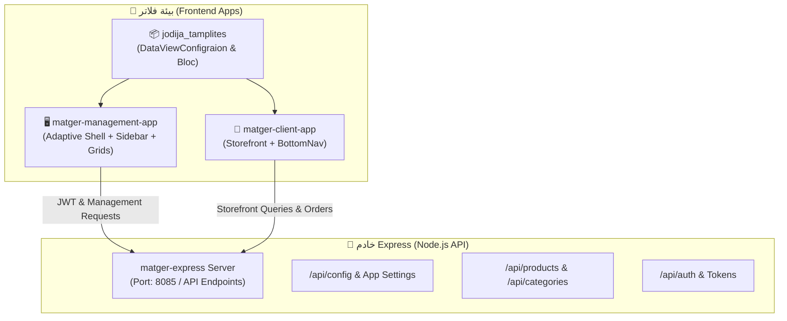

# 🔗 دليل تكامل منظومة المتجر (Matger Ecosystem Integration Guide)

يشرح هذا الدليل كيفية ربط وتكامل أطراف المنظومة الثلاثة:
1. **`matger-management-app`** (لوحة الإدارة ولوحة التحكم).
2. **`matger-client-app`** (تطبيق متجر العميل).
3. **`matger-express`** (خادم الباك إند المركزي).

---

## 1. مخطط المعمارية والاتصال المشترك



---

## 2. التكامل مع `matger-management-app` (لوحة الإدارة)

### تهيئة الـ Configuration:
```dart
class MatgerManagementConfig extends DataViewConfigraion {
  @override
  String get AppName => "Delta Mager Pro - Control Panel";

  @override
  String get AppNameID => "delta_mager_admin";

  @override
  Widget launchScreen() => const ProductsManagementScreen();

  @override
  Map<String, Widget> getRouters() => {
    '/dashboard': const AnalyticsScreen(),
    '/products': const ProductsManagementScreen(),
    '/categories': const CategoriesManagementScreen(),
    '/orders': const OrdersManagementScreen(),
  };

  @override
  void setAppLocal(String localCode) {
    // تفعيل RTL واللغة العربية
  }
}
```

### استخدام `AdaptiveAppShell`:
- تعيين `sidebarBackgroundColor: const Color(0xFF556B2F)` (الثيم الزيتي للوحة الإدارة).
- تفعيل القوائم الجانبية ومسارات لوحة التحكم.

---

## 3. التكامل مع `matger-client-app` (تطبيق العميل)

### تهيئة الـ Configuration:
```dart
class MatgerClientConfig extends DataViewConfigraion {
  @override
  String get AppName => "Delta Store";

  @override
  String get AppNameID => "delta_store_client";

  @override
  Widget launchScreen() => const StorefrontHomeScreen();

  @override
  Map<String, Widget> getRouters() => {
    '/': const StorefrontHomeScreen(),
    '/category/:id': const CategoryProductsScreen(),
    '/cart': const CartScreen(),
    '/profile': const UserProfileScreen(),
  };

  @override
  void setAppLocal(String localCode) {}
}
```

### الخصائص المميزة للعميل:
- تفعيل `isInBottomNavBar: true` للعناصر الرئيسية.
- إخفاء القائمة الجانبية الإدارية لتبسيط تجربة المستخدم.

---

## 4. التكامل مع `matger-express` (الباك إند)

### عقود الـ API المشتركة (API Contracts):
- **نقاط الإعدادات:** `GET /api/config`
  - إرجاع إعدادات المتجر العامة، العملة (`ج.م`)، اللغات المفعلة، وحالات الميزات (Feature Flags).
- **نقاط المنتجات والفئات:**
  - `GET /api/products` (يدعم معاملات التصفية `category`, `search`, `page`).
  - `GET /api/categories` (إرجاع الفئات مع عدد المنتجات وصور التصنيف).
- **المصادقة:**
  - `POST /api/auth/login` (إرجاع JWT Token ليتم تخزينه في `SharedPrefranceData`).
